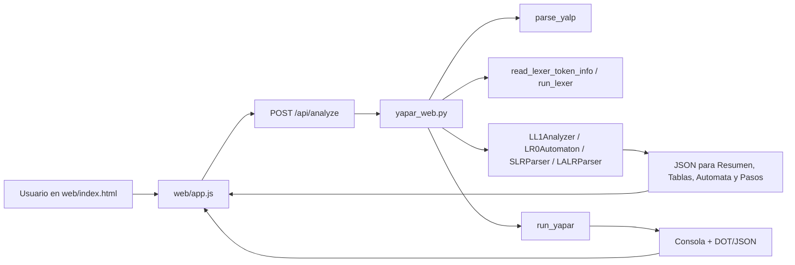

# Scan del repo y guia del frontend

Esta guia explica como esta organizada la carpeta, donde vive cada pieza
importante del codigo, que funcion cumple y en que parte del frontend se ve.

> Nota: la carpeta `Analizador-Sintactico/` que aparece dentro de la raiz es
> una copia anidada/vieja del proyecto. Para usar y explicar el sistema actual,
> tome como referencia los archivos de la raiz: `yapar.py`, `yapar_web.py`,
> `web/`, `Analizador Sintactico/`, `Analizador Lexico/`, `examples/`, `tests/`
> y `docs/`.

## 1. Como se usa el frontend

Desde la raiz del proyecto:

```bash
python3 yapar_web.py
```

La terminal imprime una URL parecida a:

```text
YAPar Web listo en http://127.0.0.1:5174
```

Abra esa URL en el navegador.

En la pantalla principal:

1. En `Ejemplo`, seleccione una gramatica precargada.
2. Presione `Cargar`.
3. Revise o edite los tres editores:
   - `Gramatica YAPar`: archivo `.yalp` con `%token`, `IGNORE` y producciones.
   - `Lexer YALex`: archivo `.yal` o lexer Python generado.
   - `Entrada`: texto que se va a tokenizar y parsear.
4. Elija el metodo:
   - `LL(1)`: parser predictivo.
   - `LR(0)`: solo construye automata LR(0).
   - `SLR`: tabla ACTION/GOTO SLR(1).
   - `LALR`: tabla ACTION/GOTO LALR(1).
5. Active o desactive:
   - `Mostrar pasos`: genera la traza del parser.
   - `Recuperacion panic-mode`: intenta seguir luego de errores.
6. Presione `Ejecutar`.
7. Lea los resultados en las pestanas:
   - `Resumen`: aceptado/rechazado, tokens, producciones y errores.
   - `Tablas`: FIRST/FOLLOW, tabla LL(1), ACTION/GOTO o transiciones.
   - `Automata`: estados e items LR.
   - `Pasos`: tokens de entrada y traza del parser.
   - `Consola`: salida textual equivalente al CLI.
8. Use `Exportar JSON` o `Exportar DOT` para descargar estructuras.

## 2. Flujo completo del sistema



Explicacion paso a paso:

1. El usuario edita o carga archivos en el frontend.
2. `web/app.js` arma un payload con `method`, `grammar`, `lexer`, `input`,
   `verbose` y `recover`.
3. `yapar_web.py` recibe el payload en `/api/analyze`.
4. Se parsea la gramatica YAPar con `parse_yalp`.
5. Si hay lexer, se leen/validan tokens con `read_lexer_token_info` y
   `validate_tokens`.
6. Si hay input, el lexer se genera/ejecuta con `ensure_lexer_script` y
   `run_lexer`.
7. Segun el metodo, se construye el analizador:
   - `LL1Analyzer`
   - `LR0Automaton`
   - `SLRParser`
   - `LALRParser`
8. `yapar_web.py` convierte los resultados a JSON.
9. `web/app.js` dibuja tablas, automata, pasos, problemas y consola.

## 3. Mapa de carpetas

| Ruta | Proposito | Donde se ve en el frontend |
|---|---|---|
| `web/index.html` | Estructura visual de la app web. | Toda la pantalla: barra superior, panel lateral, editores y resultados. |
| `web/styles.css` | Diseno responsive, colores, paneles, tablas y automata. | Apariencia completa del frontend. |
| `web/app.js` | Logica del navegador: carga ejemplos, envia analisis y renderiza resultados. | Botones, pestanas, metricas, tablas, grafos y exportaciones. |
| `yapar_web.py` | Servidor HTTP local y API del frontend. | Alimenta todo lo que aparece en el frontend. |
| `yapar.py` | CLI general. | La pestana `Consola` muestra una salida equivalente. |
| `yapar_ide.py` | GUI alternativa con Tkinter. | No aparece en el frontend web; es otra interfaz. |
| `yapar_ll1.py` | CLI/reporte especializado para LL(1). | Su informacion se ve repartida en `Tablas` cuando se usa LL(1). |
| `Analizador Sintactico/yalp_parser.py` | Parser de gramaticas `.yalp/.yapar`. | Alimenta tokens, producciones, simbolo inicial y errores de gramatica. |
| `Analizador Sintactico/token_stream.py` | Lee/ejecuta lexers y convierte salida en tokens. | Se ve en `Tokens producidos`, `Pasos` y errores lexicos. |
| `Analizador Sintactico/ll1_analyzer.py` | FIRST, FOLLOW, tabla LL(1) y parseo LL(1). | `Tablas`, `Resumen`, `Pasos`. |
| `Analizador Sintactico/lr0_automaton.py` | Automata LR(0), items, estados y DOT. | `Automata`, `Tablas`, `Exportar DOT`. |
| `Analizador Sintactico/slr_parser.py` | Tabla/action/goto y parser SLR(1). | `Tablas`, `Automata`, `Pasos`. |
| `Analizador Sintactico/lalr_parser.py` | Coleccion LR(1), fusion LALR y parser LALR(1). | `Tablas`, `Automata`, `Pasos`. |
| `Analizador Sintactico/semantic_tree.py` | Arbol semantico/parse tree serializable. | En la GUI Tkinter; no esta renderizado aun en el frontend web. |
| `Analizador Sintactico/yapar_runtime.py` | Orquestador comun para CLI, GUI y web. | `Consola`, exportaciones DOT/JSON y ejecucion general. |
| `Analizador Lexico/src_py/` | Generador YALex: regex, NFA, DFA y lexer emitido. | Se usa cuando el frontend recibe un `.yal` y necesita tokenizar input. |
| `examples/` | Casos de prueba y demos. | Selector `Ejemplo`. |
| `tests/` | Pruebas unitarias. | No se ve en la UI; valida que los algoritmos funcionen. |
| `docs/` | Documentacion. | No se ve en la UI; sirve para entrega y uso. |

## 4. Frontend web: archivo por archivo

### `web/index.html`

Define la estructura estatica:

| Linea aprox. | Elemento | Que hace | Codigo que lo controla |
|---:|---|---|---|
| 11 | `topbar` | Barra superior con marca, ejemplos y ejecutar. | `web/app.js`: `fetchExamples`, `loadSelectedExample`, `runAnalysis`. |
| 21 | `exampleSelect` | Selector de ejemplos. | `/api/examples` en `yapar_web.py`. |
| 30 | `runButton` | Ejecuta el analisis. | `runAnalysis`. |
| 37 | `control-panel` | Metodo, opciones, estado, artefactos y problemas. | `renderMetrics`, `renderProblems`, `setStatus`. |
| 40 | Radios `method` | Seleccionan LL(1), LR(0), SLR o LALR. | `getMethod`, `setMethod`. |
| 51 | `verboseToggle` | Muestra pasos. | Se manda como `verbose` a `/api/analyze`. |
| 55 | `recoverToggle` | Activa recuperacion panic-mode. | Se manda como `recover` a `/api/analyze`. |
| 76 | `exportJsonButton` | Descarga JSON. | `exportArtifact("json")`. |
| 79 | `exportDotButton` | Descarga DOT. | `exportArtifact("dot")`. |
| 93 | `editor-zone` | Tres editores. | `setEditor`, `loadFileInto`. |
| 102 | `grammarEditor` | Gramatica YAPar. | `parse_yalp` en backend. |
| 113 | `lexerEditor` | Lexer YALex/Python. | `read_lexer_token_info`, `run_lexer`. |
| 124 | `inputEditor` | Entrada a analizar. | `run_lexer` y `parse`. |
| 128 | `results-panel` | Pestanas de resultados. | `renderSummary`, `renderTables`, `renderAutomaton`, `renderSteps`, `renderConsole`. |

### `web/app.js`

Funciones principales del frontend:

| Funcion | Linea aprox. | Que hace | Donde se ve |
|---|---:|---|---|
| `$`, `$$` | 1 | Helpers para buscar elementos DOM. | Interno. |
| `init` | 43 | Arranca la app: eventos + ejemplos. | Carga inicial. |
| `bindEvents` | 48 | Conecta clicks, tabs, radios y exportaciones. | Toda interaccion de botones. |
| `fetchExamples` | 71 | Pide `/api/examples`. | Selector `Ejemplo`. |
| `loadSelectedExample` | 88 | Carga gramatica, lexer e input del ejemplo. | Boton `Cargar`. |
| `loadFileInto` | 110 | Pide `/api/read?path=...`. | Llena cada editor. |
| `setEditor` | 119 | Actualiza textarea y etiqueta de ruta. | Titulos de editores. |
| `runAnalysis` | 135 | Envia `POST /api/analyze`. | Boton `Ejecutar`. |
| `renderResult` | 166 | Coordina todos los renders. | Refresca toda la UI. |
| `renderMetrics` | 178 | Calcula tokens, estados, pasos y avisos. | Panel `Estado`. |
| `renderProblems` | 191 | Lista warnings y errores. | Panel `Problemas`. |
| `renderSummary` | 203 | Dibuja estado aceptado/rechazado, tokens y producciones. | Pestana `Resumen`. |
| `renderTables` | 258 | Dibuja FIRST/FOLLOW, ACTION/GOTO o transiciones. | Pestana `Tablas`. |
| `renderAutomaton` | 332 | Dibuja automata y tabla de estados. | Pestana `Automata`. |
| `renderSteps` | 355 | Dibuja tokens y pasos del parser. | Pestana `Pasos`. |
| `renderConsole` | 394 | Muestra salida textual del backend. | Pestana `Consola`. |
| `renderFatalError` | 398 | Muestra error global si falla API/fetch. | Pantalla de error. |
| `activateTab` | 409 | Cambia pestana activa. | Pestanas. |
| `getMethod` | 415 | Lee metodo seleccionado. | Radios de metodo. |
| `setMethod` | 419 | Marca metodo al cargar ejemplo. | Radios de metodo. |
| `setStatus` | 426 | Cambia badge `Listo/Ejecutando/Aceptado/Revisar`. | Panel `Estado`. |
| `requestJson` | 431 | Wrapper de `fetch`. | Interno API. |
| `exportArtifact` | 440 | Decide nombre/tipo de descarga. | Botones `Exportar JSON/DOT`. |
| `downloadText` | 451 | Crea descarga en navegador. | Exportaciones. |
| `statusBadge` | 463 | Badge verde/rojo. | `Resumen`. |
| `chipList` | 467 | Renderiza tokens como chips. | `Resumen`. |
| `mapTable` | 473 | Tabla de diccionarios como FIRST/FOLLOW. | `Tablas`. |
| `transitionTable` | 481 | Tabla de transiciones. | `Tablas`. |
| `stateTable` | 489 | Tabla de estados/items. | `Automata`. |
| `simpleTable` | 496 | Helper general para tablas HTML. | Todas las tablas. |
| `graphSvg` | 512 | Construye el SVG del automata. | Pestana `Automata`. |
| `problemHtml` | 600 | Renderiza un warning/error. | `Problemas` y errores de parseo. |
| `emptyState` | 604 | Mensaje cuando no hay datos. | Pestanas vacias. |
| `truncateMiddle` | 608 | Recorta textos largos de items. | Nodos del automata. |
| `escapeHtml`, `escapeAttr`, `escapeSvg` | 617 | Evitan inyectar HTML desde datos. | Seguridad/render. |

### `web/styles.css`

Define la estetica:

| Seccion CSS | Que controla | Donde se ve |
|---|---|---|
| `:root` | Paleta, sombras y variables. | Toda la UI. |
| `.topbar`, `.brand` | Header. | Arriba. |
| `.workspace` | Layout de 3 columnas. | Pantalla principal. |
| `.control-panel`, `.control-section` | Panel izquierdo. | Metodo, opciones, estado, artefactos. |
| `.segmented` | Radios con apariencia de control segmentado. | Metodo. |
| `.status-pill`, `.metric-grid` | Estado y metricas. | Panel `Estado`. |
| `.editor-zone`, `.editor-panel`, `textarea` | Editores. | Gramatica, lexer, entrada. |
| `.results-panel`, `.tabs`, `.tab-content` | Pestanas. | Panel derecho. |
| `.summary-grid`, `.info-block`, `.chip` | Resumen. | Pestana `Resumen`. |
| `table`, `.table-wrap` | Tablas. | `Tablas`, `Automata`, `Pasos`. |
| `.graph-stage`, `.node`, `.edge` | SVG del automata. | Pestana `Automata`. |
| `@media` | Responsive para pantallas pequenas. | Mobile/tablet. |

## 5. Backend web y API

### `yapar_web.py`

Este archivo convierte los algoritmos existentes en una API para el frontend.

| Funcion/clase | Linea aprox. | Que hace | Donde se ve |
|---|---:|---|---|
| `DEMO_CONFIGS` | 33 | Lista ejemplos precargados. | Selector `Ejemplo`. |
| `YaparWebHandler` | 81 | Handler HTTP. | Sirve la app y API. |
| `do_GET` | 84 | Atiende `/`, `/api/examples`, `/api/read`, `/api/health`. | Carga app, ejemplos y archivos. |
| `do_POST` | 97 | Atiende `/api/analyze`. | Boton `Ejecutar`. |
| `_handle_read` | 127 | Lee archivos dentro del proyecto. | Carga ejemplos en editores. |
| `_serve_static` | 141 | Sirve HTML/CSS/JS. | Toda la web. |
| `_send_json` | 165 | Responde JSON. | Todas las llamadas API. |
| `analyze_payload` | 174 | Orquesta gramatica, lexer, input, metodo y artefactos. | Refresca todas las pestanas. |
| `_build_analysis` | 281 | Crea `LL1Analyzer`, `LR0Automaton`, `SLRParser` o `LALRParser`. | `Resumen`, `Tablas`, `Automata`, `Pasos`. |
| `_collect_artifacts` | 353 | Lee/genera JSON y DOT. | Botones exportar. |
| `_available_examples` | 376 | Devuelve metadata de demos. | Selector `Ejemplo`. |
| `_file_metadata` | 393 | Verifica existencia/tamano de archivos ejemplo. | API de ejemplos. |
| `_spec_to_dict` | 403 | Convierte `YalpSpec` a JSON. | Tokens, producciones, inicio. |
| `_parse_result_to_dict` | 423 | Convierte resultado de parseo a JSON. | `Pasos` y errores. |
| `_token_to_dict` | 443 | Convierte token a JSON. | `Tokens de entrada`. |
| `_write_lexer_file` | 452 | Guarda lexer temporal del editor. | Necesario para analizar input. |
| `_new_run_dir` | 462 | Crea `generated/web_runs/...`. | Artefactos internos. |
| `_safe_project_path` | 469 | Evita leer fuera del proyecto. | Seguridad en `/api/read`. |
| `_is_inside` | 476 | Comprueba rutas seguras. | Seguridad. |
| `_relative` | 484 | Muestra rutas relativas. | Etiquetas y JSON. |
| `_make_server` | 491 | Busca puerto disponible. | Arranque del servidor. |
| `main` | 500 | Lee argumentos y levanta servidor. | Comando `python3 yapar_web.py`. |

Endpoints:

| Endpoint | Metodo | Uso |
|---|---|---|
| `/` | GET | Abre `web/index.html`. |
| `/app.js` | GET | Carga logica del frontend. |
| `/styles.css` | GET | Carga estilos. |
| `/api/examples` | GET | Lista ejemplos precargados. |
| `/api/read?path=...` | GET | Lee un archivo de ejemplo. |
| `/api/analyze` | POST | Ejecuta analisis completo. |
| `/api/health` | GET | Prueba rapida del servidor. |

## 6. Analizador sintactico

### `Analizador Sintactico/yalp_parser.py`

Responsable de leer una gramatica `.yalp/.yapar`.

| Funcion/clase | Linea aprox. | Que hace | Donde se ve |
|---|---:|---|---|
| `YalpParseError` | 28 | Error claro con archivo/linea/sugerencia. | Panel `Problemas`, `Consola`. |
| `Production` | 68 | Representa `A -> beta`. | Producciones en `Resumen`. |
| `TokenSection` | 79 | Resultado de `%token` e `IGNORE`. | Tokens declarados/ignorados. |
| `TokenValidationReport` | 88 | Errores/warnings de tokens usados. | `Problemas`. |
| `YalpSpec` | 100 | Modelo completo de gramatica. | Base de todo el analisis. |
| `strip_comments` | 148 | Quita comentarios `/* ... */`. | Permite editar comentarios en frontend. |
| `parse_yalp` | 196 | Parsea texto completo del editor. | Primer paso de `Ejecutar`. |
| `parse_token_section` | 256 | Lee `%token` e `IGNORE`. | Chips de tokens. |
| `_parse_token_section` | 272 | Implementacion interna. | No visible directo. |
| `get_ignored_tokens` | 332 | Devuelve tokens ignorados. | Filtrado de lexer. |
| `parse_production_section` | 338 | Lee producciones despues de `%%`. | Tabla de producciones. |
| `validate_declared_tokens` | 441 | Valida tokens usados/no usados. | Panel `Problemas`. |
| `normalize_epsilon` | 513 | Normaliza `epsilon`, `EPSILON`, `empty`. | Producciones epsilon. |
| `format_production` | 518 | Convierte una produccion a texto. | Tablas y consola. |
| `parse_yalp_file` | 523 | Version para leer archivo desde disco. | CLI y runtime. |
| `_append_production` | 537 | Agrega alternativa canonica. | Interno. |
| `_tokenize_productions` | 548 | Tokeniza RHS/LHS/`|`/`;`. | Interno. |
| `_validate_identifier` | 577 | Valida simbolos. | Errores de gramatica. |
| `_validate_token_name` | 593 | Valida nombres de tokens. | Errores de gramatica. |
| `_looks_like_token` | 610 | Detecta tokens por mayusculas. | Mensajes de error. |
| `_line_col` | 614 | Calcula linea/columna. | Mensajes de error. |
| `_format_validation_errors` | 621 | Une errores de validacion. | Panel `Problemas`. |

### `Analizador Sintactico/token_stream.py`

Conecta el lexer con los parsers.

| Funcion/clase | Linea aprox. | Que hace | Donde se ve |
|---|---:|---|---|
| `Token` | 25 | Tipo, lexema, linea y columna. | Tabla `Tokens de entrada`. |
| `LexerTokenInfo` | 60 | Tokens que produce un lexer. | `Tokens producidos por lexer`. |
| `LexerOutput` | 78 | Tokens + errores lexicos. | `Pasos`, `Problemas`. |
| `TokenConsistencyReport` | 89 | Comparacion YAPar vs YALex. | Warnings/errores. |
| `parse_lexer_output` | 102 | Lee salida `TOKEN ...` del lexer. | Tokens visibles en `Pasos`. |
| `validate_tokens` | 142 | Revisa tokens declarados/producidos. | `Problemas`. |
| `read_lexer_token_info` | 202 | Decide si leer `.yal` o `.py`. | Carga de lexer. |
| `read_yalex_spec_token_info` | 216 | Extrae tokens desde `.yal/.yalex`. | Tokens producidos. |
| `read_generated_lexer_token_info` | 250 | Extrae tokens desde lexer Python. | Tokens producidos. |
| `run_lexer` | 294 | Ejecuta lexer sobre input. | Tabla de tokens. |
| `TokenStream` | 322 | Cursor con EOF automatico. | Lo consumen los parsers. |
| `token_stream_from_lexer_output` | 372 | Convierte output a stream. | Runtime/CLI. |
| `token_stream_from_file` | 383 | Lexer + stream desde archivos. | Runtime/CLI. |
| `_decode_lexeme` | 394 | Decodifica strings impresos por lexer. | Lexemas correctos. |
| `_normalize_token_names` | 406 | Normaliza nombres para validar. | Interno. |
| `_ensure_yalex_on_path` | 414 | Agrega generador YALex al path. | Interno. |
| `_append_unique` | 420 | Evita duplicados. | Interno. |
| `_literal_assignments` | 425 | Lee constantes de lexer generado. | Interno. |
| `_invalid_token_name_warnings` | 439 | Advierte tokens incompatibles. | `Problemas`. |

### `Analizador Sintactico/ll1_analyzer.py`

Implementa LL(1).

| Funcion/clase | Linea aprox. | Que hace | Donde se ve |
|---|---:|---|---|
| `LL1Conflict` | 29 | Describe conflicto en tabla LL(1). | `Problemas`, `Tablas`. |
| `LL1ParseStep` | 45 | Un paso de parser LL(1). | Pestana `Pasos`. |
| `LL1ParseResult` | 54 | Resultado aceptado/rechazado. | `Resumen`. |
| `LL1Analyzer` | 67 | Calcula FIRST, FOLLOW, tabla y parsea. | Metodo `LL(1)`. |
| `_compute_first` | 92 | Calcula FIRST por punto fijo. | Tabla FIRST. |
| `first_of_string` | 123 | FIRST de una secuencia. | Construccion de tabla. |
| `first_of_string_with` | 127 | Version con tabla FIRST parcial. | Interno. |
| `_compute_follow` | 150 | Calcula FOLLOW. | Tabla FOLLOW. |
| `_build_table` | 184 | Construye tabla predictiva. | Tabla LL(1). |
| `_add_table_entry` | 210 | Agrega celda y detecta conflicto. | Conflictos LL(1). |
| `table_entries` | 236 | Itera tabla en orden. | Render de `Tablas`. |
| `detect_left_recursion` | 243 | Detecta recursion izquierda. | `Problemas`. |
| `parse` | 275 | Ejecuta parser predictivo. | `Resumen` y `Pasos`. |
| `report_first_follow` | 448 | Texto FIRST/FOLLOW. | CLI/reporte. |
| `report_table` | 460 | Texto de tabla LL(1). | `Consola`. |
| `report_conflicts` | 477 | Texto de conflictos. | `Consola`. |
| `format_set` | 503 | Formatea conjuntos. | CLI/consola. |
| `_append_step` | 507 | Guarda paso si `verbose`. | Pestana `Pasos`. |
| `_normalize_eof_type` | 518 | Normaliza `EOF` a `$`. | Parser. |
| `_unexpected_token_message` | 522 | Mensaje de error sintactico. | `Problemas`, `Consola`. |
| `_recover_ll1_terminal` | 535 | Recupera ante terminal inesperado. | Panic-mode. |
| `_recover_ll1_non_terminal` | 548 | Recupera usando FIRST/FOLLOW. | Panic-mode. |
| `_recover_ll1_end_marker` | 568 | Descarta extra hasta EOF. | Panic-mode. |

### `Analizador Sintactico/lr0_automaton.py`

Construye el automata LR(0), usado por LR(0), SLR y parte visual.

| Funcion/clase | Linea aprox. | Que hace | Donde se ve |
|---|---:|---|---|
| `LRProduction` | 20 | Produccion aumentada/indexada. | Estados/items y tablas. |
| `LR0Item` | 34 | Item `A -> alpha . beta`. | Nodos del automata. |
| `LR0State` | 42 | Conjunto de items. | Nodos `I0`, `I1`, etc. |
| `LR0Automaton` | 50 | Automata completo. | Pestana `Automata`. |
| `build` | 62 | Factory del automata. | Metodo `LR(0)` y `SLR`. |
| `closure` | 75 | Cerradura de items. | Construccion de estados. |
| `goto` | 92 | Transicion por simbolo. | Flechas del automata. |
| `symbol_after_dot` | 102 | Simbolo despues del punto. | Algoritmo. |
| `is_complete` | 108 | Item con punto al final. | Reducciones. |
| `productions_for` | 111 | Producciones por LHS. | Cerradura. |
| `grammar_symbols` | 114 | Simbolos que generan transiciones. | Automata. |
| `format_item` | 122 | Texto de item. | Nodos del automata. |
| `format_state` | 129 | Texto completo de estado. | DOT/consola. |
| `to_dict` | 135 | JSON del automata. | Frontend. |
| `to_dot` | 155 | DOT Graphviz. | `Exportar DOT`. |
| `write_dot` | 165 | Guarda DOT. | Artefactos. |
| `write_png` | 168 | Intenta convertir DOT a PNG. | CLI/opcional. |
| `_build_canonical_collection` | 181 | Coleccion canonica LR(0). | Estados/flechas. |
| `_build_lr_productions` | 210 | Agrega produccion inicial aumentada. | Interno. |
| `_unique_augmented_start` | 232 | Evita nombre inicial duplicado. | Interno. |
| `_dot_escape` | 240 | Escapa DOT. | Exportacion DOT. |

### `Analizador Sintactico/slr_parser.py`

Implementa SLR(1).

| Funcion/clase | Linea aprox. | Que hace | Donde se ve |
|---|---:|---|---|
| `SLRAction` | 26 | Accion shift/reduce/accept. | Tabla ACTION. |
| `SLRConflict` | 44 | Conflicto shift/reduce o reduce/reduce. | `Problemas`. |
| `SLRParseStep` | 61 | Paso SLR. | Pestana `Pasos`. |
| `SLRParseResult` | 70 | Resultado del parser. | `Resumen`. |
| `SLRParser` | 84 | Construye tabla y parsea. | Metodo `SLR`. |
| `__post_init__` | 94 | Construye automata, FOLLOW y tablas. | Al ejecutar SLR. |
| `is_slr1` | 103 | Indica si no hay conflictos. | Badge de compatibilidad. |
| `parse` | 106 | Ejecuta parser SLR. | `Resumen` y `Pasos`. |
| `action_entries` | 242 | Lista ACTION. | Pestana `Tablas`. |
| `goto_entries` | 249 | Lista GOTO. | Pestana `Tablas`. |
| `to_dict` | 256 | JSON para frontend. | `Tablas`. |
| `_build_tables` | 274 | Llena ACTION/GOTO. | Tabla SLR. |
| `_add_action` | 296 | Agrega accion y detecta conflictos. | Conflictos. |
| `_conflict_type` | 316 | Clasifica conflicto. | Mensajes. |
| `_append_step` | 325 | Guarda paso si `verbose`. | `Pasos`. |
| `_normalize_eof_type` | 336 | Normaliza EOF. | Parser. |
| `_unexpected_token_message` | 340 | Error sintactico. | `Problemas`. |
| `_recover_lr_stack_and_stream` | 353 | Recuperacion panic-mode LR. | Panic-mode. |

### `Analizador Sintactico/lalr_parser.py`

Implementa LALR(1).

| Funcion/clase | Linea aprox. | Que hace | Donde se ve |
|---|---:|---|---|
| `LR1Item` | 33 | Item LR(1) con lookahead. | Items LALR. |
| `LALRStatus` | 46 | Estado resumido de implementacion. | CLI/reporte. |
| `LR1State` | 53 | Estado LR(1)/LALR. | Automata LALR. |
| `LALRAction` | 65 | Accion ACTION. | Tabla ACTION. |
| `LALRConflict` | 83 | Conflicto LALR. | `Problemas`. |
| `LALRParseStep` | 100 | Paso LALR. | `Pasos`. |
| `LALRParseResult` | 109 | Resultado del parseo. | `Resumen`. |
| `LALRParser` | 123 | Construye LR(1), fusiona cores y parsea. | Metodo `LALR`. |
| `__post_init__` | 140 | Construye todo el parser. | Al ejecutar LALR. |
| `is_lalr1` | 159 | Indica si no hay conflictos. | Badge compatibilidad. |
| `closure` | 162 | Cerradura LR(1). | Estados. |
| `goto` | 185 | Transicion LR(1). | Flechas. |
| `symbol_after_dot` | 195 | Simbolo despues del punto. | Algoritmo. |
| `is_complete` | 201 | Item completo. | Reducciones. |
| `productions_for` | 204 | Producciones por LHS. | Cerradura. |
| `grammar_symbols` | 207 | Simbolos de transicion. | Automata. |
| `first_of_sequence` | 215 | FIRST para lookaheads. | Cerradura LR(1). |
| `parse` | 231 | Ejecuta parser LALR. | `Resumen`, `Pasos`. |
| `action_entries` | 368 | Lista ACTION. | `Tablas`. |
| `goto_entries` | 375 | Lista GOTO. | `Tablas`. |
| `format_item` | 382 | Texto de item con lookahead. | `Automata`. |
| `format_state` | 389 | Texto de estado. | DOT/consola. |
| `to_dict` | 395 | JSON para frontend. | `Tablas`, `Automata`. |
| `to_dot` | 431 | DOT Graphviz. | `Exportar DOT`. |
| `write_dot` | 441 | Guarda DOT. | Artefactos. |
| `_build_canonical_lr1_collection` | 444 | Construye LR(1). | Interno. |
| `_merge_lr1_states_by_core` | 472 | Fusiona estados por core LR(0). | LALR. |
| `_build_tables` | 504 | Llena ACTION/GOTO. | `Tablas`. |
| `_add_action` | 528 | Agrega accion y detecta conflictos. | `Problemas`. |
| `lalr_status` | 548 | Estado textual de LALR. | CLI/reporte. |
| `build_lalr_table` | 557 | Helper para construir LALR. | Tests/uso externo. |
| `_build_lr_productions` | 562 | Producciones aumentadas. | Interno. |
| `_conflict_type` | 584 | Clasifica conflicto. | Mensajes. |
| `_append_step` | 593 | Guarda paso si `verbose`. | `Pasos`. |
| `_normalize_eof_type` | 604 | Normaliza EOF. | Parser. |
| `_unexpected_token_message` | 608 | Error sintactico. | `Problemas`. |
| `_recover_lr_stack_and_stream` | 621 | Panic-mode LR. | Recuperacion. |

### `Analizador Sintactico/yapar_runtime.py`

Orquesta CLI/GUI/web usando los mismos algoritmos.

| Funcion/clase | Linea aprox. | Que hace | Donde se ve |
|---|---:|---|---|
| `RuntimeResult` | 46 | Resultado `ok + message`. | `Consola`. |
| `run_yapar` | 53 | Ejecuta flujo completo segun metodo. | `Consola`, JSON/DOT. |
| `ensure_lexer_script` | 269 | Si recibe `.yal`, genera lexer Python. | Al ejecutar input desde frontend. |
| `emit_parser_runner` | 303 | Genera parser ejecutable. | CLI, no visible en web. |
| `_format_ll1_steps` | 340 | Pasos LL(1) como texto. | `Consola`. |
| `_format_slr_steps` | 349 | Pasos SLR como texto. | `Consola`. |
| `_format_lalr_steps` | 358 | Pasos LALR como texto. | `Consola`. |
| `_append_tree_outputs` | 367 | Agrega rutas de arbol semantico si existen. | GUI/CLI, no web todavia. |

### `Analizador Sintactico/semantic_tree.py`

Modelo de arbol semantico/parse tree.

| Funcion/clase | Linea aprox. | Que hace | Donde se ve |
|---|---:|---|---|
| `SemanticNode` | 26 | Nodo terminal/no terminal/epsilon. | GUI Tkinter; pendiente en web. |
| `terminal` | 36 | Crea nodo terminal. | Arbol. |
| `epsilon` | 45 | Crea nodo epsilon. | Arbol. |
| `add_child` | 48 | Agrega hijo. | Arbol. |
| `to_dict` | 51 | Serializa nodo. | JSON de arbol. |
| `from_dict` | 64 | Reconstruye nodo. | Lectura JSON. |
| `pretty` | 79 | Texto indentado. | Salida legible. |
| `to_dot` | 93 | DOT Graphviz. | Exportacion. |
| `walk` | 113 | Recorre arbol. | Interno. |
| `write_tree_json` | 118 | Guarda JSON. | Exportacion. |
| `write_tree_dot` | 126 | Guarda DOT. | Exportacion. |
| `read_tree_json` | 130 | Lee JSON. | Importacion. |
| `forest_pretty` | 137 | Imprime varios arboles. | Salida legible. |
| `_node_label`, `_dot_escape`, `_optional_int`, `_walk` | 141 | Helpers internos. | Interno. |

## 7. Analizador lexico YALex

Estos archivos viven en `Analizador Lexico/src_py/`. El frontend no los muestra
como pantallas separadas, pero los usa indirectamente cuando se pega/carga un
lexer `.yal` y se ejecuta una entrada.

### Flujo lexico

```mermaid
flowchart LR
    A["Texto .yal"] --> B["yal_spec.parse_spec"]
    B --> C["regex_parse.parse_regex_with_lets"]
    C --> D["nfa.build_nfa_from_ast"]
    D --> E["dfa.build_dfa"]
    E --> F["emit.emit_generated_lexer"]
    F --> G["Lexer Python generado"]
    G --> H["token_stream.run_lexer"]
    H --> I["Tokens visibles en frontend"]
```



### Catalogo rapido

| Archivo | Funcion/clase | Que hace | Donde se ve |
|---|---|---|---|
| `main.py` | `run`, `main` | CLI del generador YALex. | Se invoca desde `ensure_lexer_script`. |
| `yal_spec.py` | `parse_spec` | Parsea `let`, `rule`, acciones y EOF. | Tokens producidos por lexer. |
| `yal_spec.py` | `yal_strip_comments` | Quita comentarios. | Permite comentarios en lexer. |
| `yal_spec.py` | Helpers `_parse_identifier`, `_capture_balanced`, `_capture_regex_before_action` | Lectura interna de sintaxis YALex. | Interno. |
| `regex_parse.py` | `RegexParser` | Estado del parser de regex. | Interno. |
| `regex_parse.py` | `parse_regex_with_lets` | Convierte regex en AST. | Interno del lexer. |
| `regex_parse.py` | Helpers `_parse_primary`, `_parse_postfix`, `_parse_concat`, `_parse_regex_expr` | Precedencia y operadores regex. | Interno. |
| `ast.py` | `ast_new`, `ast_empty`, `ast_charset`, `ast_clone`, `ast_eval_charset`, `make_diff_ast` | Construccion/evaluacion de AST regex. | Interno. |
| `charset.py` | `charset_add`, `charset_add_range`, `charset_union`, `charset_diff`, `charset_not`, etc. | Conjuntos de caracteres. | Interno. |
| `nfa.py` | `build_nfa_from_ast` | Convierte AST regex a NFA. | Interno. |
| `nfa.py` | `nfa_add_state`, `nfa_add_edge`, `nfa_add_charset` | Construccion NFA. | Interno. |
| `dfa.py` | `build_dfa` | Subconjuntos NFA -> DFA. | Interno. |
| `dfa.py` | `_epsilon_closure`, `_move_on_char`, `_choose_accept_token` | Helpers de DFA. | Interno. |
| `emit.py` | `infer_token_name` | Extrae nombre de token desde accion. | Validacion de tokens en frontend. |
| `emit.py` | `is_eof_regex` | Detecta regla EOF. | Validacion/ejecucion lexer. |
| `emit.py` | `emit_dot_file` | Exporta arbol/regex DOT. | Artefactos lexico, no web. |
| `emit.py` | `emit_generated_lexer` | Escribe lexer Python ejecutable. | Necesario para parsear input. |
| `emit.py` | `maybe_generate_tree_png` | Intenta PNG con Graphviz. | Opcional. |
| `yalex_types.py` | `ASTType`, `CharSet`, `AST`, `LetDef`, `RuleDef`, `YalSpec`, `NFA`, `DFA`, etc. | Estructuras de datos. | Interno. |
| `util.py` | `YalexError`, `fatal`, `read_file`, `trim_copy`, `append_text_block` | Utilidades generales. | Interno/errores. |

## 8. Entradas alternativas: CLI y GUI

### `yapar.py`

| Funcion | Que hace | Uso |
|---|---|---|
| `main` | Lee argumentos, llama `emit_parser_runner` si se pide `-o`, luego llama `run_yapar`. | `python3 yapar.py examples/calculator_parser.yalp -l "Analizador Lexico/examples/calculator.yal" --input examples/calculator_input_ok.txt --method slr` |

### `yapar_ll1.py`

| Funcion | Que hace |
|---|---|
| `main` | CLI para reporte LL(1). |
| `build_report` | Construye reporte de tokens, FIRST, FOLLOW, tabla y lexer. |
| `_format_table_entries` | Formatea celdas de tabla LL(1). |
| `_format_ordered` | Ordena conjuntos/listas para texto. |
| `_format_lexer_integration` | Resume integracion con lexer. |
| `_append_report_lines` | Agrega warnings/errores de validacion. |

### `yapar_ide.py`

GUI de escritorio con Tkinter. Es independiente del frontend web.

| Metodo/funcion | Que hace |
|---|---|
| `YaparIDE.__init__` | Crea ventana y estado inicial. |
| `_build_ui` | Construye toolbar, editores, salida y opciones. |
| `_path_row` | Fila reutilizable para rutas. |
| `_browse_grammar`, `_browse_lexer`, `_browse_input`, `_browse_dot`, `_browse_json` | Dialogos de archivos. |
| `_load_grammar` | Carga gramatica en editor. |
| `_save_grammar` | Guarda gramatica. |
| `_run` | Ejecuta `run_yapar`. |
| `_text_tab`, `_set_output`, `_set_text`, `_set_tree`, `_clear_tree_view`, `_insert_tree_node` | Render de salida/arbol. |
| `_export_tree_json`, `_export_tree_dot` | Exporta arbol. |
| `_none_if_blank` | Convierte string vacio a `None`. |
| `main` | Abre la app Tkinter. |

## 9. Ejemplos incluidos

| Archivo | Para que sirve | Frontend |
|---|---|---|
| `examples/calculator_parser.yalp` | Gramatica de calculadora. | Ejemplos `Calculadora SLR` y `Calculadora LL(1)`. |
| `Analizador Lexico/examples/calculator.yal` | Lexer para calculadora. | Cargado junto con calculadora. |
| `examples/calculator_input_ok.txt` | Entrada valida. | Aceptada. |
| `examples/calculator_input_error.txt` | Entrada invalida. | Ejemplo `Error sintactico`. |
| `examples/slr_left_recursive.yalp` | Gramatica no LL(1), aceptada por SLR. | Ejemplo `Recursion izquierda SLR`. |
| `examples/number_plus.yal` | Lexer de numeros y suma. | Ejemplo SLR. |
| `examples/lalr_not_slr.yalp` | Gramatica LALR que SLR rechaza. | Ejemplo `LALR que no es SLR`. |
| `examples/id_star_equal.yal` | Lexer para ID, STAR, EQUAL. | Ejemplo LALR. |
| `examples/slr_conflict.yalp` | Caso con conflicto SLR. | Puede cargarse manualmente. |
| `examples/token_undeclared_error.yalp` | Error de token no declarado. | Puede probarse manualmente. |

## 10. Como explicar una ejecucion en defensa

Ejemplo usando `Calculadora SLR`:

1. El frontend carga:
   - `examples/calculator_parser.yalp`
   - `Analizador Lexico/examples/calculator.yal`
   - `examples/calculator_input_ok.txt`
2. Al presionar `Ejecutar`, `runAnalysis` envia el contenido a `/api/analyze`.
3. `analyze_payload` parsea la gramatica con `parse_yalp`.
4. `read_lexer_token_info` detecta que el lexer produce `NUMBER`, `PLUS`,
   `MINUS`, `TIMES`, `DIV`, `LPAREN`, `RPAREN` y `EOF`.
5. `ensure_lexer_script` genera un lexer Python temporal si el lexer es `.yal`.
6. `run_lexer` tokeniza `12 + 7 * 3`.
7. `SLRParser` construye el automata LR(0), FOLLOW, ACTION y GOTO.
8. `SLRParser.parse` consume tokens y genera pasos porque `Mostrar pasos` esta activo.
9. `renderSummary` muestra `Entrada aceptada`.
10. `renderTables` muestra ACTION/GOTO.
11. `renderAutomaton` dibuja estados y transiciones.
12. `renderSteps` muestra tokens y stack/action paso a paso.
13. `renderConsole` muestra la salida textual de `run_yapar`.

## 11. Comandos utiles

Ejecutar frontend:

```bash
python3 yapar_web.py
```

Ejecutar CLI SLR:

```bash
python3 yapar.py examples/calculator_parser.yalp -l "Analizador Lexico/examples/calculator.yal" --input examples/calculator_input_ok.txt --method slr --verbose
```

Ejecutar CLI LALR:

```bash
python3 yapar.py examples/lalr_not_slr.yalp -l examples/id_star_equal.yal --input examples/lalr_assignment_input_ok.txt --method lalr --verbose
```

Exportar DOT/JSON:

```bash
python3 yapar.py examples/calculator_parser.yalp --method lr0 --dot generated/lr0.dot --json generated/lr0.json
```

Ejecutar pruebas:

```bash
python3 -m unittest tests/test_ll1_preprocessing.py tests/test_yapar_algorithms.py
```

Revisar sintaxis del frontend:

```bash
node --check web/app.js
```

Revisar sintaxis Python:

```bash
python3 -m py_compile yapar_web.py
```

## 12. Donde tocar si quiere agregar algo

| Objetivo | Archivo recomendado |
|---|---|
| Agregar otro ejemplo al selector | `DEMO_CONFIGS` en `yapar_web.py`. |
| Cambiar diseno visual | `web/styles.css`. |
| Agregar una nueva pestana | `web/index.html` + `activateTab`/render en `web/app.js`. |
| Mostrar mas datos en resumen | `renderSummary` en `web/app.js` y `_spec_to_dict` si falta data. |
| Mostrar mas datos de tablas | `_build_analysis` en `yapar_web.py` y `renderTables`. |
| Mejorar dibujo de automata | `graphSvg` en `web/app.js`. |
| Agregar AST/arbol al frontend | `semantic_tree.py`, `yapar_runtime.py`, una nueva pestana en `web/index.html` y render en `web/app.js`. |
| Cambiar mensajes de errores de gramatica | `yalp_parser.py`. |
| Cambiar errores sintacticos LL(1) | `ll1_analyzer.py`. |
| Cambiar errores sintacticos SLR | `slr_parser.py`. |
| Cambiar errores sintacticos LALR | `lalr_parser.py`. |
| Cambiar integracion con lexer | `token_stream.py` y `Analizador Lexico/src_py/emit.py`. |

## 13. Indice tecnico completo de funciones y clases

Este apendice sirve para ubicar rapidamente cada clase/metodo/funcion. Las
lineas son aproximadas y corresponden al estado actual del repo.

### Entradas principales

`yapar.py`

- `main` - linea 18.

`yapar_ll1.py`

- `main` - linea 36.
- `build_report` - linea 141.
- `_format_table_entries` - linea 250.
- `_format_ordered` - linea 262.
- `_format_lexer_integration` - linea 267.
- `_append_report_lines` - linea 314.

`yapar_ide.py`

- Clase `YaparIDE` - linea 21.
- `YaparIDE.__init__` - linea 24.
- `YaparIDE._build_ui` - linea 46.
- `YaparIDE._path_row` - linea 152.
- `YaparIDE._browse_grammar` - linea 166.
- `YaparIDE._browse_lexer` - linea 174.
- `YaparIDE._browse_input` - linea 181.
- `YaparIDE._browse_dot` - linea 188.
- `YaparIDE._browse_json` - linea 191.
- `YaparIDE._set_path_from_dialog` - linea 194.
- `YaparIDE._set_save_path_from_dialog` - linea 204.
- `YaparIDE._load_grammar` - linea 218.
- `YaparIDE._save_grammar` - linea 230.
- `YaparIDE._run` - linea 252.
- `YaparIDE._text_tab` - linea 276.
- `YaparIDE._set_output` - linea 297.
- `YaparIDE._set_text` - linea 300.
- `YaparIDE._set_tree` - linea 307.
- `YaparIDE._clear_tree_view` - linea 319.
- `YaparIDE._insert_tree_node` - linea 323.
- `YaparIDE._export_tree_json` - linea 337.
- `YaparIDE._export_tree_dot` - linea 353.
- `_none_if_blank` - linea 366.
- `main` - linea 371.

`yapar_web.py`

- Clase `YaparWebHandler` - linea 81.
- `YaparWebHandler.do_GET` - linea 84.
- `YaparWebHandler.do_POST` - linea 97.
- `YaparWebHandler.log_message` - linea 117.
- `YaparWebHandler._read_json_body` - linea 120.
- `YaparWebHandler._handle_read` - linea 127.
- `YaparWebHandler._serve_static` - linea 141.
- `YaparWebHandler._send_json` - linea 165.
- `analyze_payload` - linea 174.
- `_build_analysis` - linea 281.
- `_collect_artifacts` - linea 353.
- `_available_examples` - linea 376.
- `_file_metadata` - linea 393.
- `_spec_to_dict` - linea 403.
- `_parse_result_to_dict` - linea 423.
- `_token_to_dict` - linea 443.
- `_write_lexer_file` - linea 452.
- `_new_run_dir` - linea 462.
- `_safe_project_path` - linea 469.
- `_is_inside` - linea 476.
- `_relative` - linea 484.
- `_make_server` - linea 491.
- `main` - linea 500.

### Frontend

`web/app.js`

- `$` - linea 1.
- `$$` - linea 2.
- `init` - linea 43.
- `bindEvents` - linea 48.
- `fetchExamples` - linea 71.
- `loadSelectedExample` - linea 88.
- `loadFileInto` - linea 110.
- `setEditor` - linea 119.
- `runAnalysis` - linea 135.
- `renderResult` - linea 166.
- `renderMetrics` - linea 178.
- `renderProblems` - linea 191.
- `renderSummary` - linea 203.
- `renderTables` - linea 258.
- `renderAutomaton` - linea 332.
- `renderSteps` - linea 355.
- `renderConsole` - linea 394.
- `renderFatalError` - linea 398.
- `activateTab` - linea 409.
- `getMethod` - linea 415.
- `setMethod` - linea 419.
- `setStatus` - linea 426.
- `requestJson` - linea 431.
- `exportArtifact` - linea 440.
- `downloadText` - linea 451.
- `statusBadge` - linea 463.
- `chipList` - linea 467.
- `mapTable` - linea 473.
- `transitionTable` - linea 481.
- `stateTable` - linea 489.
- `simpleTable` - linea 496.
- `graphSvg` - linea 512.
- `problemHtml` - linea 600.
- `emptyState` - linea 604.
- `truncateMiddle` - linea 608.
- `escapeHtml` - linea 617.
- `escapeAttr` - linea 626.
- `escapeSvg` - linea 630.

### Analizador sintactico

`Analizador Sintactico/yalp_parser.py`

- Clase `YalpParseError` - linea 28.
- `YalpParseError.__init__` - linea 31.
- `YalpParseError.__str__` - linea 46.
- Clase `Production` - linea 68.
- `Production.__str__` - linea 74.
- Clase `TokenSection` - linea 79.
- Clase `TokenValidationReport` - linea 88.
- `TokenValidationReport.has_errors` - linea 95.
- Clase `YalpSpec` - linea 100.
- `YalpSpec.is_terminal` - linea 113.
- `YalpSpec.is_non_terminal` - linea 116.
- `YalpSpec.all_symbols` - linea 119.
- `YalpSpec.to_dict` - linea 122.
- `YalpSpec.__repr__` - linea 135.
- `strip_comments` - linea 148.
- `parse_yalp` - linea 196.
- `parse_token_section` - linea 256.
- `_parse_token_section` - linea 272.
- `get_ignored_tokens` - linea 332.
- `parse_production_section` - linea 338.
- `validate_declared_tokens` - linea 441.
- `normalize_epsilon` - linea 513.
- `format_production` - linea 518.
- `parse_yalp_file` - linea 523.
- `_append_production` - linea 537.
- `_tokenize_productions` - linea 548.
- `_validate_identifier` - linea 577.
- `_validate_token_name` - linea 593.
- `_looks_like_token` - linea 610.
- `_line_col` - linea 614.
- `_format_validation_errors` - linea 621.

`Analizador Sintactico/token_stream.py`

- Clase `Token` - linea 25.
- `Token.column` - linea 34.
- `Token.__repr__` - linea 38.
- Clase `LexerTokenInfo` - linea 60.
- `LexerTokenInfo.produced_token_names` - linea 70.
- Clase `LexerOutput` - linea 78.
- `LexerOutput.has_errors` - linea 84.
- Clase `TokenConsistencyReport` - linea 89.
- `TokenConsistencyReport.has_errors` - linea 98.
- `parse_lexer_output` - linea 102.
- `validate_tokens` - linea 142.
- `read_lexer_token_info` - linea 202.
- `read_yalex_spec_token_info` - linea 216.
- `read_generated_lexer_token_info` - linea 250.
- `run_lexer` - linea 294.
- Clase `TokenStream` - linea 322.
- `TokenStream.__init__` - linea 325.
- `TokenStream.current` - linea 335.
- `TokenStream.at_end` - linea 339.
- `TokenStream.peek` - linea 342.
- `TokenStream.consume` - linea 348.
- `TokenStream.expect` - linea 354.
- `TokenStream.__iter__` - linea 363.
- `TokenStream.__repr__` - linea 367.
- `token_stream_from_lexer_output` - linea 372.
- `token_stream_from_file` - linea 383.
- `_decode_lexeme` - linea 394.
- `_normalize_token_names` - linea 406.
- `_ensure_yalex_on_path` - linea 414.
- `_append_unique` - linea 420.
- `_literal_assignments` - linea 425.
- `_invalid_token_name_warnings` - linea 439.

`Analizador Sintactico/ll1_analyzer.py`

- Clase `LL1Conflict` - linea 29.
- `LL1Conflict.existing_text` - linea 37.
- `LL1Conflict.new_text` - linea 40.
- Clase `LL1ParseStep` - linea 45.
- Clase `LL1ParseResult` - linea 54.
- Clase `LL1Analyzer` - linea 67.
- `LL1Analyzer.__init__` - linea 78.
- `LL1Analyzer._compute_first` - linea 92.
- `LL1Analyzer.first_of_string` - linea 123.
- `LL1Analyzer.first_of_string_with` - linea 127.
- `LL1Analyzer._compute_follow` - linea 150.
- `LL1Analyzer._build_table` - linea 184.
- `LL1Analyzer._add_table_entry` - linea 210.
- `LL1Analyzer.table_entries` - linea 236.
- `LL1Analyzer.detect_left_recursion` - linea 243.
- `LL1Analyzer.parse` - linea 275.
- `LL1Analyzer.report_first_follow` - linea 448.
- `LL1Analyzer.report_table` - linea 460.
- `LL1Analyzer.report_conflicts` - linea 477.
- `format_set` - linea 503.
- `_append_step` - linea 507.
- `_normalize_eof_type` - linea 518.
- `_unexpected_token_message` - linea 522.
- `_recover_ll1_terminal` - linea 535.
- `_recover_ll1_non_terminal` - linea 548.
- `_recover_ll1_end_marker` - linea 568.

`Analizador Sintactico/lr0_automaton.py`

- Clase `LRProduction` - linea 20.
- `LRProduction.text` - linea 28.
- Clase `LR0Item` - linea 34.
- Clase `LR0State` - linea 42.
- Clase `LR0Automaton` - linea 50.
- `LR0Automaton.build` - linea 62.
- `LR0Automaton.closure` - linea 75.
- `LR0Automaton.goto` - linea 92.
- `LR0Automaton.symbol_after_dot` - linea 102.
- `LR0Automaton.is_complete` - linea 108.
- `LR0Automaton.productions_for` - linea 111.
- `LR0Automaton.grammar_symbols` - linea 114.
- `LR0Automaton.format_item` - linea 122.
- `LR0Automaton.format_state` - linea 129.
- `LR0Automaton.to_dict` - linea 135.
- `LR0Automaton.to_dot` - linea 155.
- `LR0Automaton.write_dot` - linea 165.
- `LR0Automaton.write_png` - linea 168.
- `LR0Automaton._build_canonical_collection` - linea 181.
- `_build_lr_productions` - linea 210.
- `_unique_augmented_start` - linea 232.
- `_dot_escape` - linea 240.

`Analizador Sintactico/slr_parser.py`

- Clase `SLRAction` - linea 26.
- `SLRAction.text` - linea 33.
- Clase `SLRConflict` - linea 44.
- `SLRConflict.text` - linea 53.
- Clase `SLRParseStep` - linea 61.
- Clase `SLRParseResult` - linea 70.
- Clase `SLRParser` - linea 84.
- `SLRParser.__post_init__` - linea 94.
- `SLRParser.is_slr1` - linea 103.
- `SLRParser.parse` - linea 106.
- `SLRParser.action_entries` - linea 242.
- `SLRParser.goto_entries` - linea 249.
- `SLRParser.to_dict` - linea 256.
- `SLRParser._build_tables` - linea 274.
- `SLRParser._add_action` - linea 296.
- `_conflict_type` - linea 316.
- `_append_step` - linea 325.
- `_normalize_eof_type` - linea 336.
- `_unexpected_token_message` - linea 340.
- `_recover_lr_stack_and_stream` - linea 353.

`Analizador Sintactico/lalr_parser.py`

- Clase `LR1Item` - linea 33.
- `LR1Item.core` - linea 41.
- Clase `LALRStatus` - linea 46.
- Clase `LR1State` - linea 53.
- `LR1State.core` - linea 60.
- Clase `LALRAction` - linea 65.
- `LALRAction.text` - linea 72.
- Clase `LALRConflict` - linea 83.
- `LALRConflict.text` - linea 92.
- Clase `LALRParseStep` - linea 100.
- Clase `LALRParseResult` - linea 109.
- Clase `LALRParser` - linea 123.
- `LALRParser.__post_init__` - linea 140.
- `LALRParser.is_lalr1` - linea 159.
- `LALRParser.closure` - linea 162.
- `LALRParser.goto` - linea 185.
- `LALRParser.symbol_after_dot` - linea 195.
- `LALRParser.is_complete` - linea 201.
- `LALRParser.productions_for` - linea 204.
- `LALRParser.grammar_symbols` - linea 207.
- `LALRParser.first_of_sequence` - linea 215.
- `LALRParser.parse` - linea 231.
- `LALRParser.action_entries` - linea 368.
- `LALRParser.goto_entries` - linea 375.
- `LALRParser.format_item` - linea 382.
- `LALRParser.format_state` - linea 389.
- `LALRParser.to_dict` - linea 395.
- `LALRParser.to_dot` - linea 431.
- `LALRParser.write_dot` - linea 441.
- `LALRParser._build_canonical_lr1_collection` - linea 444.
- `LALRParser._merge_lr1_states_by_core` - linea 472.
- `LALRParser._build_tables` - linea 504.
- `LALRParser._add_action` - linea 528.
- `lalr_status` - linea 548.
- `build_lalr_table` - linea 557.
- `_build_lr_productions` - linea 562.
- `_conflict_type` - linea 584.
- `_append_step` - linea 593.
- `_normalize_eof_type` - linea 604.
- `_unexpected_token_message` - linea 608.
- `_recover_lr_stack_and_stream` - linea 621.

`Analizador Sintactico/yapar_runtime.py`

- Clase `RuntimeResult` - linea 46.
- `run_yapar` - linea 53.
- `ensure_lexer_script` - linea 269.
- `emit_parser_runner` - linea 303.
- `_format_ll1_steps` - linea 340.
- `_format_slr_steps` - linea 349.
- `_format_lalr_steps` - linea 358.
- `_append_tree_outputs` - linea 367.

`Analizador Sintactico/semantic_tree.py`

- Clase `SemanticNode` - linea 26.
- `SemanticNode.terminal` - linea 36.
- `SemanticNode.epsilon` - linea 45.
- `SemanticNode.add_child` - linea 48.
- `SemanticNode.to_dict` - linea 51.
- `SemanticNode.from_dict` - linea 64.
- `SemanticNode.pretty` - linea 79.
- `SemanticNode.to_dot` - linea 93.
- `SemanticNode.walk` - linea 113.
- `write_tree_json` - linea 118.
- `write_tree_dot` - linea 126.
- `read_tree_json` - linea 130.
- `forest_pretty` - linea 137.
- `_node_label` - linea 141.
- `_dot_escape` - linea 150.
- `_optional_int` - linea 158.
- `_walk` - linea 164.

### Analizador lexico

`Analizador Lexico/src_py/main.py`

- `run` - linea 14.
- `main` - linea 65.

`Analizador Lexico/src_py/yal_spec.py`

- `find_let` - linea 7.
- `_is_ident_start` - linea 14.
- `_is_ident` - linea 18.
- `_starts_kw` - linea 22.
- `_skip_ws` - linea 29.
- `_parse_identifier` - linea 35.
- `_capture_balanced` - linea 45.
- `yal_strip_comments` - linea 87.
- `_capture_regex_before_action` - linea 144.
- `parse_spec` - linea 189.

`Analizador Lexico/src_py/regex_parse.py`

- Clase `RegexParser` - linea 13.
- `_skip_ws` - linea 19.
- `_peek` - linea 24.
- `_get` - linea 28.
- `_match` - linea 35.
- `_parse_escape_char` - linea 42.
- `_parse_char_literal` - linea 49.
- `_parse_set_char` - linea 60.
- `_resolve_let_ast` - linea 71.
- `_is_ident_start` - linea 90.
- `_is_ident` - linea 94.
- `_parse_primary` - linea 98.
- `_parse_diff_atom` - linea 168.
- `_parse_postfix` - linea 183.
- `_next_starts_primary` - linea 200.
- `_parse_concat` - linea 210.
- `_parse_regex_expr` - linea 222.
- `parse_regex_with_lets` - linea 233.

`Analizador Lexico/src_py/ast.py`

- `ast_new` - linea 7.
- `ast_empty` - linea 11.
- `ast_charset` - linea 15.
- `ast_clone` - linea 19.
- `ast_eval_charset` - linea 28.
- `make_diff_ast` - linea 48.

`Analizador Lexico/src_py/charset.py`

- `charset_clear` - linea 6.
- `charset_fill` - linea 10.
- `charset_add` - linea 14.
- `charset_add_range` - linea 18.
- `charset_union` - linea 25.
- `charset_diff` - linea 31.
- `charset_not` - linea 37.
- `charset_count` - linea 41.

`Analizador Lexico/src_py/nfa.py`

- `nfa_add_state` - linea 8.
- `nfa_add_edge` - linea 13.
- `nfa_add_charset` - linea 17.
- `build_nfa_from_ast` - linea 22.

`Analizador Lexico/src_py/dfa.py`

- `_epsilon_closure` - linea 6.
- `_move_on_char` - linea 18.
- `_choose_accept_token` - linea 29.
- `build_dfa` - linea 38.

`Analizador Lexico/src_py/emit.py`

- `infer_token_name` - linea 12.
- `is_eof_regex` - linea 33.
- `_dot_escape` - linea 37.
- `_charset_label` - linea 52.
- `emit_dot_file` - linea 68.
- `emit_generated_lexer` - linea 118.
- `maybe_generate_tree_png` - linea 217.

`Analizador Lexico/src_py/yalex_types.py`

- Clase `ASTType` - linea 7.
- Clase `CharSet` - linea 20.
- Clase `AST` - linea 25.
- Clase `LetDef` - linea 33.
- Clase `RuleDef` - linea 41.
- Clase `YalSpec` - linea 51.
- Clase `NFAEdge` - linea 61.
- Clase `NFAState` - linea 67.
- Clase `NFA` - linea 73.
- Clase `Frag` - linea 79.
- Clase `DFA` - linea 85.

`Analizador Lexico/src_py/util.py`

- Clase `YalexError` - linea 4.
- `fatal` - linea 8.
- `read_file` - linea 12.
- `trim_copy` - linea 21.
- `append_text_block` - linea 25.

### Tests

`tests/test_ll1_preprocessing.py`

- Clase `LL1PreprocessingTests` - linea 41.

`tests/test_yapar_algorithms.py`

- Clase `YaparAlgorithmTests` - linea 73.
